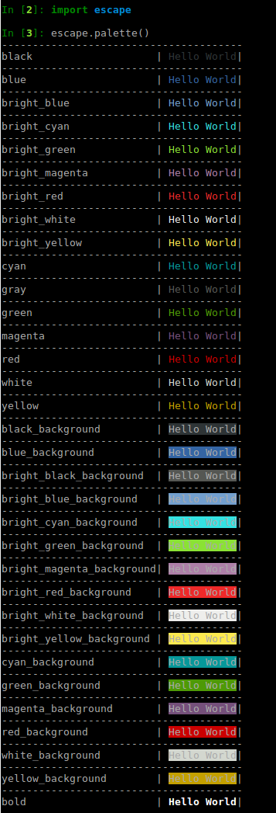

[](https://travis-ci.org/skabbass1/escape)

# escape
Escape is a very simple  terminal styling library largely inspired by the excellent javascript [chalk](https://github.com/chalk/chalk)
library. There are other terminal styling libraries such as [colorama](https://github.com/tartley/colorama) available but they do not offer a simple composable API like escape does. Escape is pure python, does not have any external dependencies and should work right out of the box. Escape has been tested to work with **python 2.7** and **python 3.6**. Escape **has not** been tested on Windows

# Install
```bash
pip install escape
```

# Usage
```python
from escape import Escape

print(Escape('Hello World').red())

# combine styled strings
print(Escape('Hello').bright_green() + Escape(' World!').bright_red())

# combibe styled and normal string
print(Escape('Hello').bright_magenta() + ' World!')

# compose multiple styles together
print(Escape('Hello World').bright_red().underline().bright_yellow_background())

# Nest styles
Escape('Hello ', Escape('World').bright_green_background()).bright_red()

Escape('Hello ' +  Escape('World').bright_green_background()).bright_red()

```
# Preview how styling looks on your terminal
```python
from escape import palette
palette()
```


# Styles

### Modifiers
* bold
* dim
* hidden
* inverse
* italic
* strikethrough
* underline

### Colors
 * black
 * red
 * green
 * yellow
 * blue
 * magenta
 * cyan
 * white
 * gray
 * bright_red
 * bright_green
 * bright_yellow
 * bright_blue
 * bright_magenta
 * bright_cyan
 * bright_white


### Background Colors
 * black_background
 * red_background
 * green_background
 * yellow_background
 * blue_background
 * magenta_background
 * cyan_background
 * white_background
 * bright_black_background
 * bright_red_background
 * bright_green_background
 * bright_yellow_background
 * bright_blue_background
 * bright_magenta_background
 * bright_cyan_background
 * bright_white_background
 
 
